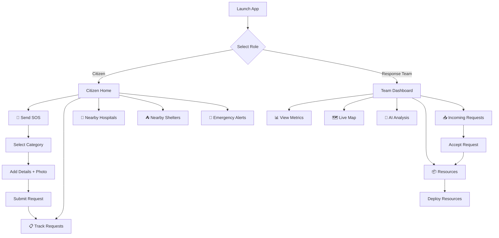

<div align="center">

# 🛡️ DRIS — Disaster Response Intelligence System

### *Real-time Disaster Management & Emergency Coordination Platform*

[](https://expo.dev)
[](https://reactnative.dev)
[](https://expo.dev)
[](./LICENSE)

**Built for Smart India Hackathon (SIH) 2026 — Internal Round**

</div>

---

## 📋 Problem Statement

During natural disasters and emergencies, the lack of a unified, real-time coordination system between citizens and response teams leads to:

- **Delayed response times** due to fragmented communication channels
- **Inefficient resource allocation** with no visibility into available assets
- **Information gaps** preventing situational awareness for both citizens and responders
- **No real-time tracking** of rescue requests from submission to resolution

**DRIS bridges this gap** by providing a dual-interface mobile platform that connects affected citizens directly with disaster response teams, enabling faster, smarter, and more coordinated emergency management.

---

## 🎯 Solution Overview

DRIS is a **cross-platform mobile application** built with React Native & Expo that provides two distinct interfaces:

| 👤 **Citizen Interface** | 🛡️ **Response Team Interface** |
|---|---|
| One-tap SOS emergency requests | Real-time incident dashboard with metrics |
| Category-based emergency reporting (Medical, Flood, Fire, Rescue, Food & Water) | Live map view with incident markers, hospitals & relief camps |
| Real-time request tracking with timeline | AI-powered risk analysis & recommendations |
| Nearby hospital & shelter locator | Resource allocation & deployment management |
| Emergency alert notifications | Incoming request queue with accept/dispatch workflow |

---

## ✨ Key Features

### 🚨 SOS Emergency System
- Multi-step emergency request flow with **category selection** (Medical, Flood, Fire, Rescue, Food & Water)
- **Camera integration** for attaching incident photos via `expo-image-picker`
- Auto-captures **GPS location** for precise incident reporting
- Fields for number of people affected and emergency contact number

### 📊 Response Team Dashboard
- Live metrics: **Active Incidents**, **Deployed Teams**, **People Affected**, **Critical Alerts**
- Incoming request queue with priority-based color coding
- Tabular view of all active incidents with type, location, severity, and status

### 🗺️ Live Incident Map
- Interactive **MapView** powered by `react-native-maps`
- Real-time markers for active SOS requests with priority-based coloring
- Static markers for hospitals and relief camps
- Callout overlays showing incident type, priority, and status
- Map legend for quick visual reference

### 🤖 AI-Powered Analysis
- **Real-time Risk Score** (0–100) computed from active incident count and priority levels
- **Incident Distribution** breakdown with visual progress bars
- **Smart Recommendations** engine that generates context-aware action items (e.g., "Deploy mobile medical units", "Evacuate low-lying areas")

### 📦 Resource Management
- Visual **resource allocation interface** with stepper controls
- Tracks available resources: Ambulances, Rescue Boats, Medical Kits, Relief Supplies, Fire Trucks
- One-tap deployment with quantity selection
- Recent deployment history log

### 📍 Request Lifecycle Tracking
- **5-stage visual timeline**: Request Received → Team Assigned → Resources Deployed → Team En Route → Incident Resolved
- Displays assigned team name and ETA at relevant stages
- Both citizens and response teams can track progress in real-time

### 🏥 Nearby Facilities
- **Hospital locator** with distance, availability status, and bed count
- **Shelter finder** with capacity information and current occupancy
- Color-coded availability indicators (Available / Full / Limited)

---

## 🏗️ Architecture

```
DRIS/
├── app/                          # Expo Router — File-based routing
│   ├── _layout.js                # Root layout with providers
│   ├── index.js                  # Role selection screen (Citizen / Response Team)
│   ├── (citizen)/                # Citizen route group
│   │   ├── _layout.js            # Tab navigator (Home, Requests, Hospitals, Shelters, Alerts)
│   │   ├── index.js              # Citizen home — action grid + SOS trigger
│   │   ├── requests.js           # Track submitted requests
│   │   ├── hospitals.js          # Nearby hospitals list
│   │   ├── shelters.js           # Nearby shelters list
│   │   └── alerts.js             # Emergency alert feed
│   ├── (team)/                   # Response team route group
│   │   ├── _layout.js            # Tab navigator (Dashboard, Map, AI, Resources, Requests)
│   │   ├── index.js              # Team dashboard — metrics + incident table
│   │   ├── map.js                # Live incident map
│   │   ├── ai-analysis.js        # AI risk analysis & recommendations
│   │   ├── resources.js          # Resource allocation & deployment
│   │   └── requests.js           # Incoming request queue
│   └── incident/
│       └── [id].js               # Incident detail view
├── components/                   # Reusable UI components
│   ├── SOSSheet.js               # Emergency request bottom sheet
│   ├── RequestCard.js            # Request summary card
│   ├── AlertCard.js              # Emergency alert card
│   ├── ResourceAllocator.js      # Resource stepper interface
│   ├── TrackingTimeline.js       # 5-stage progress timeline
│   ├── DataTable.js              # Generic data table
│   ├── RoleSelection.js          # Role picker component
│   └── StatusDot.js              # Color-coded status indicator
├── hooks/                        # React Context providers
│   ├── RoleContext.js            # Role state (citizen/team) with AsyncStorage
│   ├── RequestContext.js         # Request CRUD operations & state
│   └── SimulationContext.js      # Simulation data provider
├── services/
│   └── mockData.js               # Mock incident, resource & facility data
├── constants/
│   └── Colors.js                 # Design system color tokens
└── assets/                       # App icons, splash screen, images
```

---

## 🛠️ Tech Stack

| Layer | Technology |
|---|---|
| **Framework** | [Expo SDK 57](https://docs.expo.dev/versions/v57.0.0/) |
| **UI Runtime** | [React Native 0.86](https://reactnative.dev) |
| **Navigation** | [Expo Router](https://docs.expo.dev/router/introduction/) (file-based routing) |
| **Maps** | [react-native-maps](https://github.com/react-native-maps/react-native-maps) |
| **UI Components** | [React Native Paper](https://reactnativepaper.com/) |
| **Icons** | [@expo/vector-icons](https://icons.expo.fyi/) (MaterialCommunityIcons) |
| **Camera** | [expo-image-picker](https://docs.expo.dev/versions/v57.0.0/sdk/imagepicker/) |
| **Animations** | [react-native-reanimated](https://docs.swmansion.com/react-native-reanimated/) |
| **State** | React Context API + [AsyncStorage](https://react-native-async-storage.github.io/async-storage/) |
| **Platform** | Android, iOS, Web |

---

## 🚀 Getting Started

### Prerequisites

- **Node.js** ≥ 18.x
- **npm** ≥ 9.x
- **Expo CLI** (bundled with `npx`)
- **Expo Go** app on your mobile device ([Android](https://play.google.com/store/apps/details?id=host.exp.exponent) / [iOS](https://apps.apple.com/app/expo-go/id982107779))

### Installation

1. **Clone the repository**

   ```bash
   git clone https://github.com/Pragadeesh-79/DRIS.git
   cd DRIS
   ```

2. **Install dependencies**

   ```bash
   npm install
   ```

3. **Start the development server**

   ```bash
   npx expo start
   ```

4. **Run on your device**

   - Scan the QR code with **Expo Go** (Android) or the **Camera app** (iOS)
   - Or press `a` for Android emulator / `i` for iOS simulator / `w` for web browser

### Available Scripts

| Command | Description |
|---|---|
| `npm start` | Start the Expo development server |
| `npm run android` | Start on Android emulator |
| `npm run ios` | Start on iOS simulator |
| `npm run web` | Start in web browser |
| `npm run lint` | Run ESLint |

---

## 📱 User Flow



---

## 🤝 Team

| Name | Role |
|---|---|
| **Pragadeesh** | Lead Developer |

---

## 📄 License

This project is licensed under the **MIT License** — see the [LICENSE](./LICENSE) file for details.

---

## 🙏 Acknowledgments

- [National Disaster Management Authority (NDMA)](https://ndma.gov.in/) for domain inspiration
- [Expo](https://expo.dev) & [React Native](https://reactnative.dev) communities
- Smart India Hackathon organizing committee

---

<div align="center">

**Built with ❤️ for a safer India**

*SIH 2026 — Internal Hackathon Prototype*

</div>
